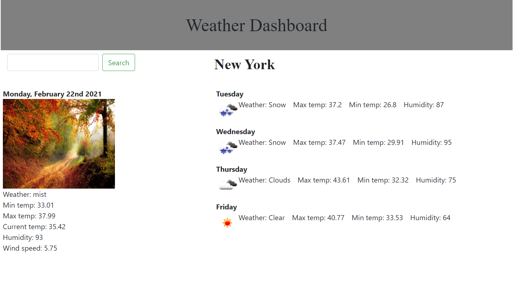

# Title

Weather Forecast Dashboard

A singple page application which provides a 5-day weather forecast for a searched city. Auto-populates New-York on startup.

# Installation

A live deployment can be found here: <a href="https://nboutin109.github.io/Weather-forecast-API/">https://nboutin109.github.io/Weather-forecast-API/</a>

To use locally, simply download the files and open the index.html file with an internet browser. 

## Built With
<ul>
<li>jQuery - CDN included</li>
<li>Bootstrap - CDN included</li>
<li>openweathermap.org - API data for weather included</li>
<li>pixabay.com - API for image based on weather included</li>
</ul>

## Code Overview
On rendering, the user interface is created from the index.html page and styled with the included .css file and Bootstrap. The script.js page then runs a single function to search for weather data from New York with multiple AJAX calls and changes the HTML values on the page. The same function executes for a different city whenever the search button is clicked.